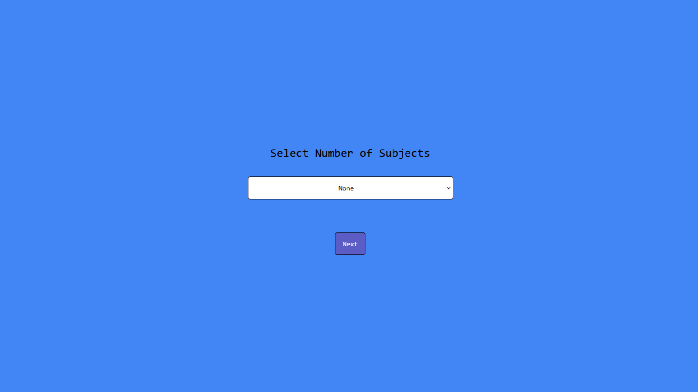
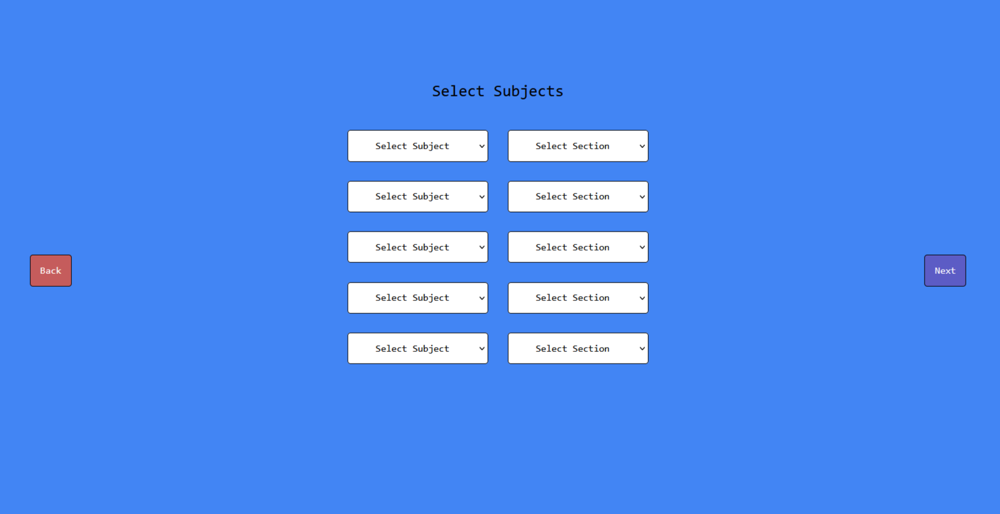
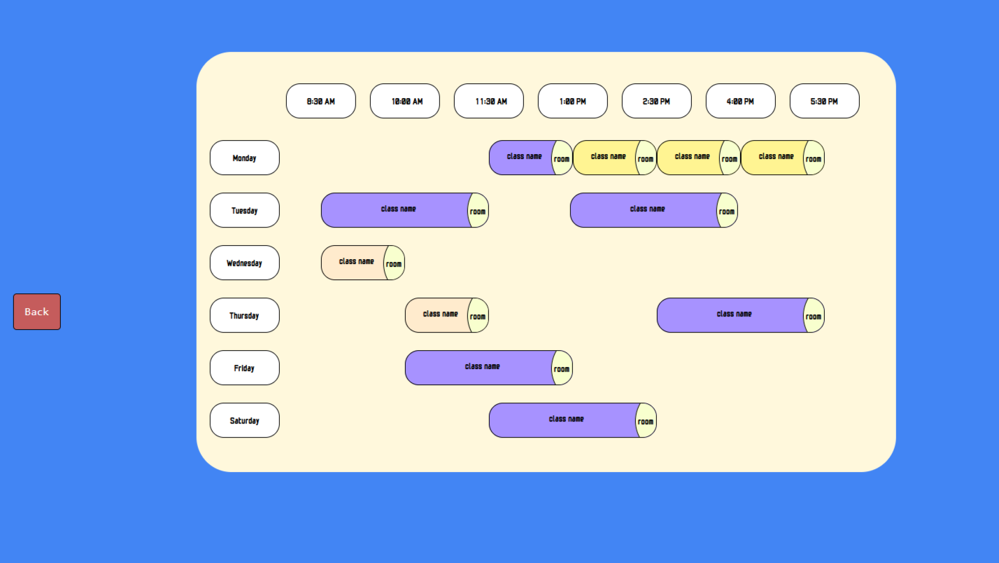

<link rel="stylesheet" href="https://use.fontawesome.com/releases/v5.14.0/css/all.css" integrity="sha384-HzLeBuhoNPvSl5KYnjx0BT+WB0QEEqLprO+NBkkk5gbc67FTaL7XIGa2w1L0Xbgc" crossorigin="anonymous">

### Submitted to Hack the Classroom 2023
# TimeTable-Generator
Not Your Average TimeTabel Generator 
## Inspiration
its always a pain to sit and search for your classes and fabricate timetable for your self. If you are like me, you spend you time asking your classmates about when and where the the next class is. So in order to make it easier and kind of automate this long process i present you the Timetable generator
## What it does
It ask user about how many classes he have, which classes and which sections ( provided via data extracted from excel sheet using js ) and it makes all possible timetables for you. Removing timetables with clashes and contradiction ( overlapping classes ) 
## how it was built?
I built is using React.js, Js, and CSS
## What's next for Smart TimeTable Genrator
I will keep it open source and make it live soon after i complete it. Will add features. It's currently only in accordance to my college provided schedule. Will find a way so its generic. you can upload your schedule. it will analyze and do the rest
## Screeshots

